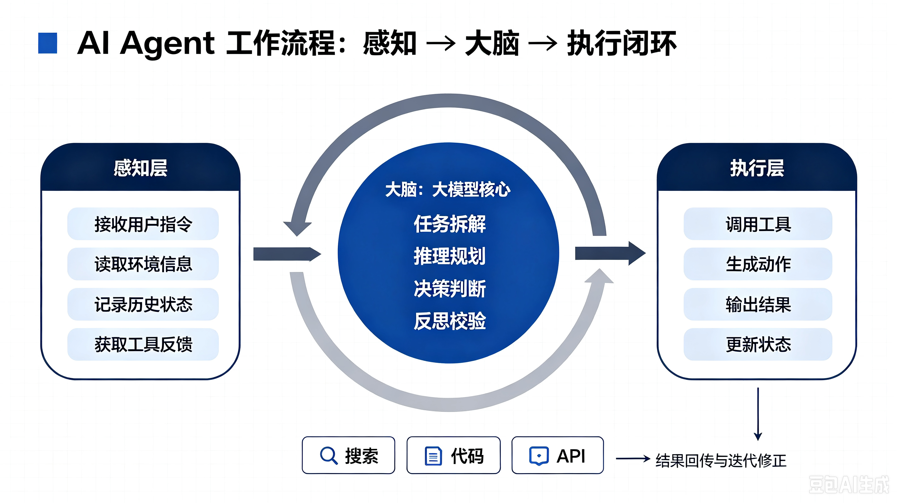

# AI agent基础

##### 一、什么是 AI Agent

###### 基础定义

AI Agent 即人工智能智能体，是具备自主感知、思考、规划、行动、反思能力的 AI 程序，不只是单纯回答问题，能自主拆解复杂任务、调用工具、分步完成目标。

普通大模型：被动问答，你问一句它答一句，不会主动做事；

AI Agent：有独立目标，自主规划流程，自动调用工具（搜索、表格、代码、软件接口），循环迭代直到任务完成。

##### 二、AI Agent 工作原理（分层拆解）

整体是循环闭环流程，分为 6 大核心模块，持续循环执行直到任务结束。

###### 1\. 感知模块（输入层）

负责收集全部外部信息，作为 Agent 的 “感官”

用户输入：需求、问题、约束条件（比如 “今天内完成市场分析”）

环境信息：联网搜索数据、本地文件、数据库、软件返回结果、历史对话记录

状态记录：保存当前任务进度、已完成步骤、工具返回数据

###### 2\. 记忆模块（存储层）

Agent 的 “大脑记忆库”，分三类记忆，支撑长期复杂任务

瞬时记忆（短期）：本轮对话上下文，刚执行完的工具结果，临时数据

中期记忆（任务记忆）：本次任务所有步骤、中间产出、已验证信息，任务结束清空

长期记忆（知识库）：历史任务经验、通用知识、用户习惯、专业资料，永久留存，可检索复用

###### 3\. 规划推理模块（核心思考层）

大模型作为 Agent 的 “大脑”，核心逻辑分两步：

目标拆解

接收用户复杂需求，判断任务难度，拆分有序子任务。

例：需求 “写一份 2026 电子产品市场报告”

拆解：①搜索行业数据 ②整理竞品信息 ③分析趋势 ④撰写正文 ⑤排版美化

决策判断

判断当前该做什么：是否需要调用工具？还是直接输出答案？现有信息是否足够？出错了要不要重新搜索？

###### 4\. 工具调用模块（行动执行层）

Agent 的 “手脚”，模型本身无法联网、操作软件，依靠工具拓展能力

常见工具：搜索引擎、计算器、代码解释器、Excel/Word、数据库 API、爬虫、绘图工具、第三方系统接口

执行逻辑：模型生成标准化工具调用指令 → 系统执行工具 → 把工具结果返回给模型

###### 5\. 执行与反馈模块（落地行动）

根据规划 + 工具返回结果，产出阶段性结果：文字、表格、代码、文件等，并把执行结果传回记忆模块存档。

###### 6\. 反思校验模块（迭代优化层）

Agent 独有的闭环关键，普通大模型没有该环节

校验当前信息是否完整、准确、满足用户要求

判断是否达成最终目标：完成则结束任务；未完成则重新规划

错误修正：数据缺失重新搜索、逻辑错误调整方案、结果不符合要求重新生成

##### 三、Agent 三层工作流程

感知层：收集用户需求、文件、网页、历史对话、工具返回数据，统一输入给大模型

大脑层（核心大模型）：读取记忆、拆解任务、判断是否调用工具、生成行动方案、自我校验反思

执行层：根据模型指令调用各类工具完成操作，把执行结果传回感知层，形成无限循环闭环，直到任务完成

